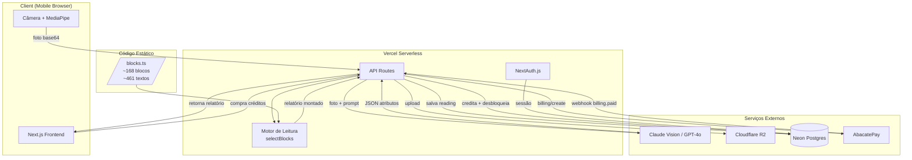
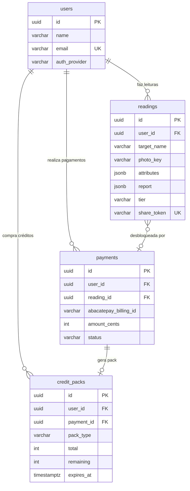
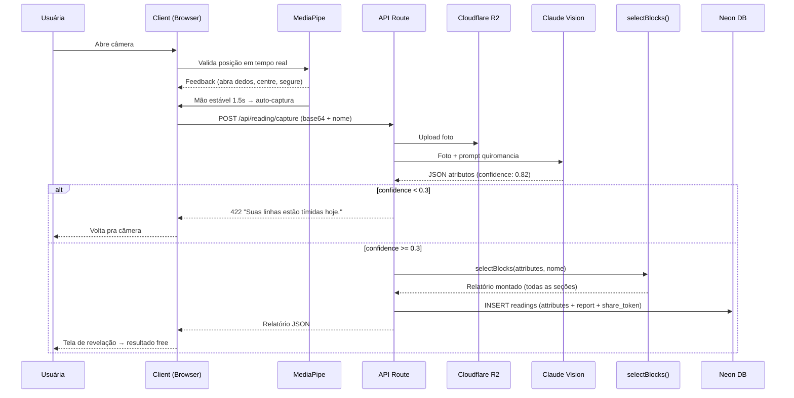
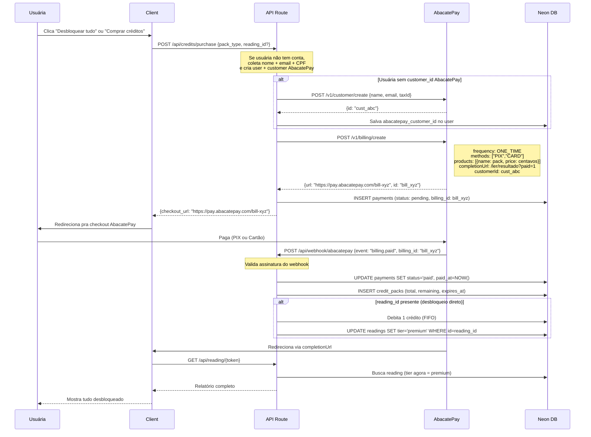

# MÃOSFALAM — Arquitetura Backend

## Documento consolidado · Fonte de verdade técnica

Versão 3.0 · Abril 2026
Atualizado com: blocos no código, relatório v2, sistema de créditos, integração AbacatePay, área logada.

---

## 1. Visão Geral

MãosFalam é um webapp mobile-first de quiromancia com IA. A pessoa fotografa a palma, a IA extrai atributos, o motor de leitura monta um relatório personalizado a partir de blocos pré-escritos.

### Stack

| Camada              | Tecnologia                                                                 |
| ------------------- | -------------------------------------------------------------------------- |
| Frontend            | Next.js 14+ (App Router) + TypeScript strict + Tailwind v4 + Framer Motion |
| Banco de dados      | Neon (Serverless Postgres) + Prisma ORM                                    |
| Storage de fotos    | Cloudflare R2 (S3 compatível)                                              |
| Visão computacional | API multimodal (Claude Vision ou GPT-4o)                                   |
| Detecção no client  | MediaPipe Hand Landmarker                                                  |
| Motor de leitura    | Blocos pré-escritos em TypeScript (código, não banco)                      |
| Pagamentos          | AbacatePay (PIX + Cartão via Billing API)                                  |
| Auth                | NextAuth.js (Google OAuth + email/senha)                                   |
| Deploy              | Vercel free tier                                                           |
| CI/CD               | GitHub Actions (develop + main)                                            |
| Logging             | Pino (structured, zero console.log)                                        |
| Testes              | Vitest (unit) + Playwright (E2E)                                           |

### Diagrama de Arquitetura



---

## 2. Schema do Banco de Dados (Neon)

Todas as tabelas usam UUID v4 como PK e timestamps com timezone.

### 2.1 Tabela: users

```sql
CREATE TABLE users (
  id              UUID PRIMARY KEY DEFAULT gen_random_uuid(),
  name            VARCHAR(100) NOT NULL,
  email           VARCHAR(255) UNIQUE NOT NULL,
  phone           VARCHAR(20),
  password_hash   VARCHAR(255),           -- NULL se OAuth
  auth_provider   VARCHAR(20) NOT NULL,   -- 'email' | 'google' | 'apple'
  auth_provider_id VARCHAR(255),          -- ID externo do OAuth
  avatar_url      VARCHAR(500),           -- foto do Google
  created_at      TIMESTAMPTZ DEFAULT NOW(),
  updated_at      TIMESTAMPTZ DEFAULT NOW()
);
```

**Nota:** is_premium e premium_until foram REMOVIDOS. O sistema agora usa créditos, não assinatura.

### 2.2 Tabela: readings

```sql
CREATE TABLE readings (
  id              UUID PRIMARY KEY DEFAULT gen_random_uuid(),
  user_id         UUID REFERENCES users(id),  -- NULL se anônima
  session_id      VARCHAR(64),                -- ID de sessão pra anônimas
  target_name     VARCHAR(100) NOT NULL,      -- nome da pessoa lida (pode ser outra)
  photo_key       VARCHAR(500) NOT NULL,      -- key da foto no R2
  photo_hand      VARCHAR(10) NOT NULL,       -- 'left' | 'right' | 'both'
  attributes      JSONB NOT NULL,             -- atributos extraídos pela IA
  report          JSONB NOT NULL,             -- relatório montado (todas as seções)
  tier            VARCHAR(10) DEFAULT 'free', -- 'free' | 'premium'
  share_token     VARCHAR(64) UNIQUE,
  share_expires_at TIMESTAMPTZ,              -- created_at + 30 dias
  confidence      DECIMAL(3,2),              -- 0.00 a 1.00
  is_active       BOOLEAN DEFAULT true,
  created_at      TIMESTAMPTZ DEFAULT NOW()
);

CREATE INDEX idx_readings_user ON readings(user_id);
CREATE INDEX idx_readings_share ON readings(share_token);
CREATE INDEX idx_readings_session ON readings(session_id);
```

**Campo `report` (JSONB):**
Contém o relatório COMPLETO (free + premium). O frontend decide o que mostrar com base no `tier`. Estrutura:

```json
{
  "element": { "type": "fire", "intro": "...", "body": "...", "impact": "..." },
  "sections": [
    {
      "chapter": 1,
      "key": "heart",
      "title": "Como você ama",
      "label": "♀ Linha do Coração · Vênus",
      "tier": "free",
      "accent": "rose",
      "opening": "Sua Linha do Coração corta a palma inteira...",
      "body": "Quando você ama, ama com tudo...",
      "modifiers": ["Bifurcação no final: Seu coração se divide..."],
      "measurement": { "comprimento": "Longa. Atravessa a palma inteira.", ... },
      "transition": "Isso é como você ama. Agora eu preciso te contar..."
    },
    {
      "chapter": 2,
      "key": "head",
      "tier": "premium",
      ...
    }
  ],
  "crossings": [...],
  "compatibility": [...],
  "rare_signs": [...],
  "impact_phrase": "Você carrega mais do que mostra..."
}
```

### 2.3 Tabela: credit_packs

```sql
CREATE TABLE credit_packs (
  id              UUID PRIMARY KEY DEFAULT gen_random_uuid(),
  user_id         UUID REFERENCES users(id) NOT NULL,
  payment_id      UUID REFERENCES payments(id),
  pack_type       VARCHAR(20) NOT NULL,       -- 'avulsa' | 'dupla' | 'roda' | 'tsara'
  total           INTEGER NOT NULL,           -- créditos comprados
  remaining       INTEGER NOT NULL,           -- créditos restantes
  expires_at      TIMESTAMPTZ NOT NULL,       -- created_at + 90 dias
  created_at      TIMESTAMPTZ DEFAULT NOW()
);

CREATE INDEX idx_credits_user ON credit_packs(user_id);
CREATE INDEX idx_credits_active ON credit_packs(user_id, remaining, expires_at);
```

**Lógica de saldo:**

```sql
-- Saldo atual do usuário
SELECT COALESCE(SUM(remaining), 0) as balance
FROM credit_packs
WHERE user_id = $1
  AND remaining > 0
  AND expires_at > NOW();
```

**Lógica de débito (FIFO):**

```sql
-- Debita 1 crédito do pack mais antigo que ainda tem saldo
UPDATE credit_packs
SET remaining = remaining - 1
WHERE id = (
  SELECT id FROM credit_packs
  WHERE user_id = $1
    AND remaining > 0
    AND expires_at > NOW()
  ORDER BY created_at ASC
  LIMIT 1
);
```

### 2.4 Tabela: payments

```sql
CREATE TABLE payments (
  id                  UUID PRIMARY KEY DEFAULT gen_random_uuid(),
  user_id             UUID REFERENCES users(id) NOT NULL,
  reading_id          UUID REFERENCES readings(id),  -- NULL se compra de pacote avulso
  abacatepay_billing_id VARCHAR(100),                -- bill_123456
  abacatepay_customer_id VARCHAR(100),               -- cust_abcdef
  pack_type           VARCHAR(20) NOT NULL,
  amount_cents        INTEGER NOT NULL,              -- valor em centavos
  method              VARCHAR(10),                   -- 'pix' | 'card'
  status              VARCHAR(20) DEFAULT 'pending', -- 'pending' | 'paid' | 'failed' | 'expired'
  paid_at             TIMESTAMPTZ,
  created_at          TIMESTAMPTZ DEFAULT NOW(),
  updated_at          TIMESTAMPTZ DEFAULT NOW()
);

CREATE INDEX idx_payments_user ON payments(user_id);
CREATE INDEX idx_payments_billing ON payments(abacatepay_billing_id);
```

### 2.5 Pacotes de créditos

```typescript
// /src/data/credit-packs.ts
export const CREDIT_PACKS = {
  avulsa: { credits: 1, price_cents: 1490, label: "Avulsa", discount: null },
  dupla: { credits: 2, price_cents: 2490, label: "Dupla", discount: "16% off" },
  roda: { credits: 5, price_cents: 4990, label: "Roda", discount: "33% off", popular: true },
  tsara: { credits: 10, price_cents: 7990, label: "Tsara", discount: "46% off" },
} as const;
```

### Diagrama de relações



---

## 3. Motor de Leitura

### 3.1 Decisão: blocos no código, não no banco

Os ~168 blocos base (~461 textos com variações) vivem em `/src/data/blocks/`. É um dataset pequeno (~600KB) que não justifica banco + API + seed + cold start. Migração pro banco quando precisar de A/B testing ou editor de conteúdo.

### 3.2 Estrutura dos blocos

```typescript
// /src/data/blocks/index.ts
import { elementBlocks } from "./element";
import { heartBlocks } from "./heart";
import { headBlocks } from "./head";
import { lifeBlocks } from "./life";
import { fateBlocks } from "./fate";
import { mountBlocks } from "./mounts";
import { rareSignBlocks } from "./rare-signs";
import { crossingBlocks } from "./crossings";
import { compatibilityBlocks } from "./compatibility";
import { transitions } from "./transitions";
import { impactPhrases } from "./impact-phrases";

export const BLOCKS = {
  element: elementBlocks,
  heart: heartBlocks,
  head: headBlocks,
  life: lifeBlocks,
  fate: fateBlocks,
  mounts: mountBlocks,
  rareSigns: rareSignBlocks,
  crossings: crossingBlocks,
  compatibility: compatibilityBlocks,
  transitions,
  impactPhrases,
} as const;
```

```typescript
// /src/data/blocks/heart.ts (exemplo)
export const heartBlocks = {
  heart_long_straight: {
    intro: [
      "Sua Linha do Coração corta a palma inteira sem desvio. Sem curva. Sem hesitação.",
      "Sua Linha do Coração é reta como decisão tomada. Sem volta.",
      "Uma linha reta. Do começo ao fim. Sem curva, sem dúvida."
    ],
    body: [
      "Quando você ama, ama com tudo. Não existe versão parcial...",
      "Você não faz amor pela metade. Entra inteira ou não entra...",
      "Seu coração funciona em binário. Tudo ou nada..."
    ],
    impact: [
      "Quando você ama, é tudo. Quando sai, queima o caminho. E não olha pra trás.",
      "Você ama em alta definição. E quando termina, termina em silêncio.",
      "Cada toque fica. Cada ausência fica mais."
    ]
  },
  heart_long_curved: { ... },
  // ... demais variações
} as const;
```

### 3.3 Função selectBlocks

```typescript
// /src/server/domains/content/block-selector.service.ts
import { BLOCKS } from "@/data/blocks";
import type { HandAttributes, ReportSections } from "./types";

export function selectBlocks(attributes: HandAttributes, name: string): ReportSections {
  const rand = (arr: readonly string[]) => arr[Math.floor(Math.random() * arr.length)];

  // 1. Elemento
  const element = BLOCKS.element[attributes.hand_type];

  // 2. Coração (free)
  const heartKey = getVariationKey("heart", attributes.lines.heart);
  const heart = BLOCKS.heart[heartKey];
  const heartMods = getModifiers("heart", attributes.lines.heart);

  // 3. Cabeça (premium)
  const headKey = getVariationKey("head", attributes.lines.head);
  const head = BLOCKS.head[headKey];

  // 4. Vida (premium)
  const lifeKey = getVariationKey("life", attributes.lines.life);
  const life = BLOCKS.life[lifeKey];

  // 5. Intimidade / Monte de Vênus (premium)
  const venus = attributes.mounts.venus === "pronounced" ? BLOCKS.mounts.venus : null;

  // 6. Montes restantes (premium, sem repetir Vênus)
  const mounts = Object.entries(attributes.mounts)
    .filter(([key, val]) => val === "pronounced" && key !== "venus")
    .map(([key]) => ({ key, ...BLOCKS.mounts[key] }));

  // 7. Destino (premium)
  const fate = attributes.lines.fate.present
    ? BLOCKS.fate[getVariationKey("fate", attributes.lines.fate)]
    : BLOCKS.fate.fate_absent;

  // 8. Cruzamentos (premium, condicionais)
  const crossings = BLOCKS.crossings
    .filter((c) => c.condition(attributes))
    .map((c) => ({ ...c, text: rand(c.texts) }));

  // 9. Compatibilidade (premium, 4 combos do elemento)
  const compat = ["fire", "water", "earth", "air"].map((other) => ({
    combo: `${attributes.hand_type}_${other}`,
    ...BLOCKS.compatibility[`${attributes.hand_type}_${other}`],
    text: rand(BLOCKS.compatibility[`${attributes.hand_type}_${other}`].texts),
  }));

  // 10. Sinais raros (premium)
  const rares = attributes.rare_signs.map((sign) => ({
    sign,
    ...BLOCKS.rareSigns[sign],
    text: rand(BLOCKS.rareSigns[sign].texts),
  }));

  // 11. Frase de impacto
  const impact = selectImpactPhrase(attributes);

  // Monta relatório com nomes substituídos
  return buildReport({
    element,
    heart,
    heartMods,
    head,
    life,
    venus,
    mounts,
    fate,
    crossings,
    compat,
    rares,
    impact,
    name,
  });
}
```

**Performance:** <1ms. É lookup por chave + randomização. Zero I/O.

---

## 4. Fluxo Completo da Leitura



### Validação da foto (duas camadas)

**Camada 1 — MediaPipe no client (antes de enviar):**
Mão presente no frame, palma aberta (landmarks dos dedos), mão estável por 1.5s, mão centralizada, iluminação mínima.

Feedback da cigana em tempo real:

- Sem mão: "Preciso ver sua mão. Posiciona no centro."
- Mão fechada: "Abre mais os dedos. Preciso ver as linhas."
- Tremendo: "Segura... quase..."
- Pouca luz: "Preciso de mais luz. Suas linhas estão tímidas."

**Camada 2 — Confidence da IA (depois de enviar):**

- > = 0.7: leitura completa, alta qualidade
- 0.3-0.7: leitura possível, menos detalhes (sinais raros e mods podem não ser detectados)
- < 0.3: REJEITA. "Suas linhas estão tímidas hoje. Tente de novo com mais luz."

---

## 5. Integração AbacatePay

### 5.1 Endpoints utilizados

| Ação           | Endpoint AbacatePay                   | Quando                        |
| -------------- | ------------------------------------- | ----------------------------- |
| Criar customer | `POST /v1/customer/create`            | Primeiro pagamento da usuária |
| Criar cobrança | `POST /v1/billing/create`             | Usuária escolhe pacote        |
| Webhook        | `billing.paid`                        | AbacatePay confirma pagamento |
| Simular (dev)  | `POST /v1/pixQrCode/simulate-payment` | Testes                        |

### 5.2 Fluxo de compra de créditos



### 5.3 Payload de criação de cobrança

```typescript
// /src/server/domains/payment/payment.service.ts
const billing = await abacatepay.post("/v1/billing/create", {
  frequency: "ONE_TIME",
  methods: ["PIX", "CARD"],
  products: [
    {
      externalId: `pack_${packType}_${Date.now()}`,
      name: `MãosFalam · ${CREDIT_PACKS[packType].label}`,
      description: `${CREDIT_PACKS[packType].credits} crédito(s) de leitura`,
      quantity: 1,
      price: CREDIT_PACKS[packType].price_cents,
    },
  ],
  returnUrl: `${BASE_URL}/creditos`,
  completionUrl: readingId
    ? `${BASE_URL}/ler/resultado/${readingToken}?paid=1`
    : `${BASE_URL}/conta/creditos?purchased=1`,
  customerId: user.abacatepay_customer_id,
});
```

### 5.4 Webhook handler

```typescript
// /src/app/api/webhook/abacatepay/route.ts
export async function POST(req: Request) {
  const body = await req.json();

  // TODO: validar assinatura do webhook (AbacatePay docs)

  if (body.event === "billing.paid") {
    const payment = await db.payments.findFirst({
      where: { abacatepay_billing_id: body.data.id },
    });

    if (!payment || payment.status === "paid") return; // idempotente

    await db.$transaction([
      // 1. Marca pagamento como pago
      db.payments.update({
        where: { id: payment.id },
        data: { status: "paid", paid_at: new Date(), method: body.data.method },
      }),
      // 2. Cria pack de créditos
      db.credit_packs.create({
        data: {
          user_id: payment.user_id,
          payment_id: payment.id,
          pack_type: payment.pack_type,
          total: CREDIT_PACKS[payment.pack_type].credits,
          remaining: CREDIT_PACKS[payment.pack_type].credits,
          expires_at: addDays(new Date(), 90),
        },
      }),
      // 3. Se tem reading_id, desbloqueia direto
      ...(payment.reading_id
        ? [
            // Debita 1 crédito FIFO
            debitOneCredit(payment.user_id),
            // Muda tier
            db.readings.update({
              where: { id: payment.reading_id },
              data: { tier: "premium" },
            }),
          ]
        : []),
    ]);
  }

  return Response.json({ ok: true });
}
```

---

## 6. Autenticação

### 6.1 NextAuth.js com Google + Email

```typescript
// /src/app/api/auth/[...nextauth]/route.ts
import NextAuth from "next-auth";
import GoogleProvider from "next-auth/providers/google";
import CredentialsProvider from "next-auth/providers/credentials";

export const authOptions = {
  providers: [
    GoogleProvider({
      clientId: process.env.GOOGLE_CLIENT_ID,
      clientSecret: process.env.GOOGLE_CLIENT_SECRET,
    }),
    CredentialsProvider({
      name: "email",
      credentials: {
        email: { type: "email" },
        password: { type: "password" },
      },
      authorize: async (credentials) => {
        // valida email/senha contra users no Neon
      },
    }),
  ],
  callbacks: {
    session: ({ session, token }) => ({ ...session, userId: token.sub }),
  },
};
```

### 6.2 Fluxo de registro durante pagamento

Se a pessoa está anônima e clica "Desbloquear tudo":

1. Tela coleta: nome, email, CPF (mínimo pro AbacatePay)
2. Backend cria user no Neon + customer no AbacatePay
3. Vincula a leitura anônima ao user recém-criado (via session_id)
4. Prossegue pro checkout

Voz da cigana no formulário: "Preciso saber quem você é antes de continuar."

---

## 7. API Routes

### 7.1 Leitura

| Método | Rota                   | Descrição                                     | Auth |
| ------ | ---------------------- | --------------------------------------------- | ---- |
| POST   | `/api/reading/capture` | Recebe foto, chama IA, monta relatório, salva | Não  |
| GET    | `/api/reading/[token]` | Busca leitura pelo share_token                | Não  |

**POST /api/reading/capture**

```
Request:  { photo: string (base64), name: string, session_id?: string }
Response: { reading_id, share_token, report: ReportJSON, tier: 'free' }
Errors:   422 (low confidence), 400 (foto inválida), 500 (IA falhou)
```

**GET /api/reading/[token]**

```
Response: { report: ReportJSON, tier, target_name, element, created_at }
Errors:   404 (não encontrada), 410 (expirada)
```

### 7.2 Créditos e Pagamento

| Método | Rota                      | Descrição                 | Auth       |
| ------ | ------------------------- | ------------------------- | ---------- |
| POST   | `/api/credits/purchase`   | Cria cobrança AbacatePay  | Sim        |
| GET    | `/api/user/credits`       | Saldo + packs + expiração | Sim        |
| POST   | `/api/webhook/abacatepay` | Webhook do AbacatePay     | Assinatura |

**POST /api/credits/purchase**

```
Request:  { pack_type: 'avulsa'|'dupla'|'roda'|'tsara', reading_id?: string }
Response: { checkout_url: string, payment_id: string }
```

**GET /api/user/credits**

```
Response: {
  balance: number,
  packs: [{ pack_type, remaining, total, expires_at, created_at }],
  next_expiration: { date, credits_expiring }
}
```

### 7.3 Área Logada

| Método | Rota                 | Descrição                             | Auth |
| ------ | -------------------- | ------------------------------------- | ---- |
| GET    | `/api/user/readings` | Lista leituras da usuária             | Sim  |
| GET    | `/api/user/profile`  | Dados do perfil                       | Sim  |
| PUT    | `/api/user/profile`  | Editar nome/email                     | Sim  |
| DELETE | `/api/user/account`  | Excluir conta (confirmação "EXCLUIR") | Sim  |

**GET /api/user/readings**

```
Response: {
  readings: [{
    id, target_name, element, tier, created_at,
    share_token, share_expires_at, impact_phrase
  }]
}
```

### 7.4 Nova Leitura

| Método | Rota               | Descrição           | Auth     |
| ------ | ------------------ | ------------------- | -------- |
| POST   | `/api/reading/new` | Inicia nova leitura | Opcional |

**POST /api/reading/new**

```
Request:  { for_self: boolean, target_name?: string }
Response: { session_id, has_credits: boolean, credits_balance: number }
```

Lógica:

- Se logada e tem créditos: confirma uso de 1 crédito, vai pra câmera
- Se logada sem créditos: opção de leitura free ou comprar
- Se anônima: leitura free, sugere criar conta depois

---

## 8. Estrutura de Pastas

```
/src
  /app                          # Next.js App Router
    /api
      /reading
        /capture/route.ts       # POST: foto → IA → blocos → salva
        /[token]/route.ts       # GET: busca leitura salva
        /new/route.ts           # POST: inicia nova leitura
      /credits
        /purchase/route.ts      # POST: cria cobrança AbacatePay
      /user
        /readings/route.ts      # GET: lista leituras
        /credits/route.ts       # GET: saldo de créditos
        /profile/route.ts       # GET/PUT: perfil
        /account/route.ts       # DELETE: excluir conta
      /webhook
        /abacatepay/route.ts    # POST: webhook
      /auth
        /[...nextauth]/route.ts # NextAuth

  /server                       # Backend DDD
    /domains
      /reading
        reading.service.ts
        reading.repository.ts
        reading.types.ts
        reading.schema.ts       # Zod
        __tests__/
      /content
        block-selector.service.ts   # selectBlocks()
        report-builder.service.ts   # buildReport()
        variation-key.service.ts    # getVariationKey()
        __tests__/
      /identity
        auth.service.ts
        user.repository.ts
        __tests__/
      /payment
        payment.service.ts      # integração AbacatePay
        credit.service.ts       # saldo, débito FIFO
        webhook.handler.ts
        __tests__/
      /sharing
        share.service.ts
        __tests__/
    /shared
      /logger                   # Pino
      /errors                   # DomainError
      /middleware                # auth, rate-limit, validation

  /data                         # Dados estáticos (blocos no código)
    /blocks
      index.ts
      element.ts
      heart.ts
      head.ts
      life.ts
      fate.ts
      mounts.ts
      rare-signs.ts
      crossings.ts
      compatibility.ts
      transitions.ts
      impact-phrases.ts
    credit-packs.ts

  /components
  /hooks
  /mocks
  /types

/prisma
  schema.prisma
  /migrations
```

---

## 9. Bounded Contexts (DDD)

| Contexto | Responsabilidade                       | Serviços externos      |
| -------- | -------------------------------------- | ---------------------- |
| Reading  | Captura, análise IA, salvamento        | Vision API, R2         |
| Content  | Blocos, motor de montagem, variações   | Nenhum (código)        |
| Identity | Auth, users, sessões                   | NextAuth, Google OAuth |
| Payment  | Checkout, créditos, webhook, packs     | AbacatePay             |
| Sharing  | Links públicos, share cards, OG images | Nenhum                 |

Regras: cada domínio tem seu `__tests__/`, TDD (teste antes da implementação), DomainError pra erros tipados, Zod pra validação de inputs.

---

## 10. Debug e Observabilidade

**REGRA: console.log é proibido em produção.**

```typescript
import { logger } from "@/server/shared/logger";

// Níveis: trace, debug, info, warn, error, fatal
logger.info({ readingId, userId, action: "capture_started" });
logger.error({ readingId, error: err.message, stack: err.stack });
logger.warn({ readingId, confidence: 0.25, action: "low_confidence_rejected" });
```

Níveis por ambiente: DEV=debug, STAGING=info, PROD=warn.
ESLint `no-console: error` quebra o build.
NUNCA logar dados pessoais (email, nome, CPF, foto).

---

## 11. CI/CD e Deploy

### Branches

- `main`: produção (maosfalam.com.br)
- `develop`: staging (preview Vercel)
- `feature/*`: features individuais
- `hotfix/*`: correções urgentes

### GitHub Actions (CI)

```yaml
on:
  push: { branches: [develop] }
  pull_request: { branches: [main] }

jobs:
  ci:
    steps:
      - npm ci
      - npm run lint # ESLint (inclui no-console)
      - npm run type-check # tsc --noEmit
      - npm run test # Vitest
      - npm run test:e2e # Playwright (só em PR pra main)
```

Branch protection em main: CI passing + self-review.

---

## 12. Env Vars

```env
# Banco
DATABASE_URL=postgresql://...@...neon.tech/maosfalam

# Storage
R2_ACCOUNT_ID=
R2_ACCESS_KEY_ID=
R2_SECRET_ACCESS_KEY=
R2_BUCKET_NAME=maosfalam-photos

# IA
ANTHROPIC_API_KEY=        # ou OPENAI_API_KEY

# Pagamento
ABACATEPAY_API_KEY=
ABACATEPAY_WEBHOOK_SECRET=

# Auth
NEXTAUTH_SECRET=
NEXTAUTH_URL=https://maosfalam.com.br
GOOGLE_CLIENT_ID=
GOOGLE_CLIENT_SECRET=

# App
LOG_LEVEL=debug           # debug | info | warn
BASE_URL=https://maosfalam.com.br
```

---

## 13. Estimativa de Custos (MVP)

| Serviço        | Custo mensal                         | Nota                     |
| -------------- | ------------------------------------ | ------------------------ |
| Vercel         | R$0                                  | free tier                |
| Neon DB        | R$0                                  | free tier (0.5GB)        |
| Cloudflare R2  | R$0                                  | free tier (10GB)         |
| API de Visão   | ~R$0,13/leitura                      | ~R$130 pra 1000 leituras |
| AbacatePay     | PIX: R$0,80/tx · Cartão: 3.5%+R$0,60 | Só cobra quando vende    |
| Domínio        | ~R$3,33/mês                          | .com.br anual            |
| **Total fixo** | **~R$3,33/mês**                      |                          |

Break-even: 1 venda de pacote Avulsa (R$14,90).

---

## 14. O que NÃO está no MVP (V2/Futuro)

- Tabela `reading_blocks` no banco (blocos ficam no código por enquanto)
- Comparação ativa entre duas mãos (compatibilidade é passiva por elemento)
- Leitura mão esquerda vs direita comparativa
- Assinatura mensal/anual
- App nativo
- Previsões periódicas ("sua mão este mês")
- A/B testing de textos
- Editor de conteúdo pra não-devs
- Cupons AbacatePay (a API suporta, implementar quando tiver estratégia)
